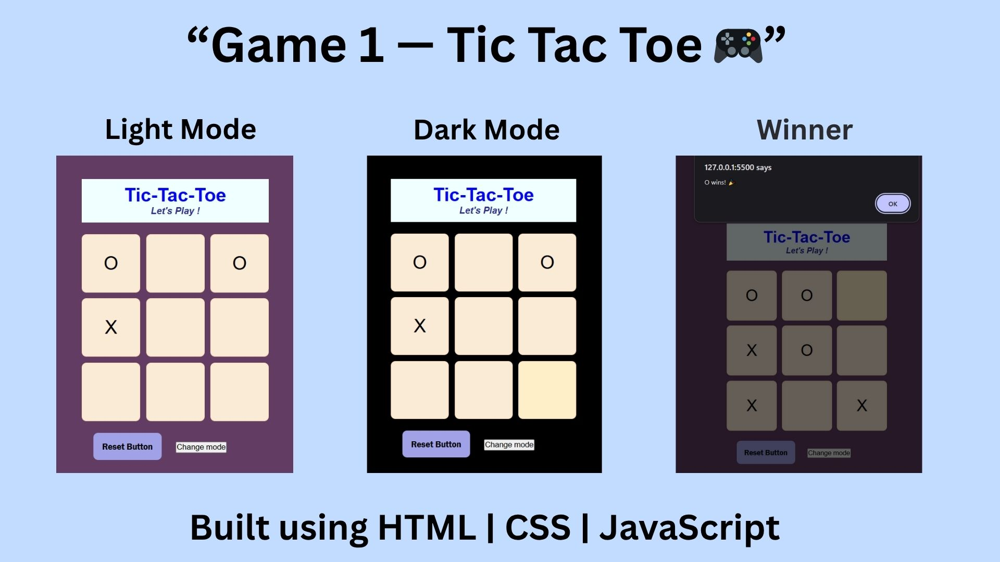

# ❌⭕ Tic Tac Toe Game

A classic **Tic Tac Toe** game built using HTML, CSS, and JavaScript.  
Play against your friend and see who gets three in a row first!

## 🚀 Features
- Two-player mode.
- Clean and responsive interface.
- Highlights winning combinations.
- Reset button to start a new match.
- Displays current player turn and game result dynamically.

## 🧠 How to Play
1. The board has 9 squares (3x3 grid).
2. Players take turns marking X or O on empty squares.
3. The first to get **three in a row** (horizontally, vertically, or diagonally) wins.
4. Click **Reset** to start a new game anytime.

## 💻 Technologies Used
- HTML
- CSS
- JavaScript (DOM manipulation and logic handling)

## 📸 Preview

  

## ⚙️ Setup
To play locally:
1. Download or clone this repository.
2. Open the `index.html` file in your browser.

## 🌟 Future Enhancements
- Add single-player mode (vs computer).
- Add score tracking.
- Add animations and sound effects.

---
✨ *Built with ❤️ by Ayushi Maurya*
